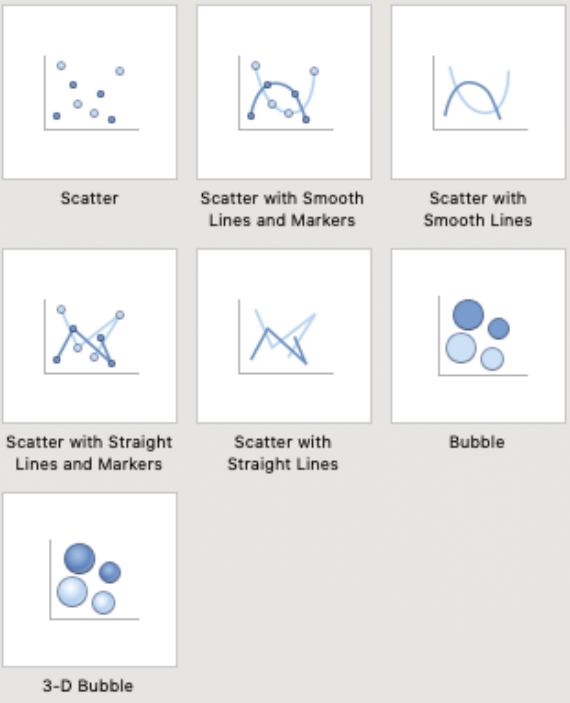
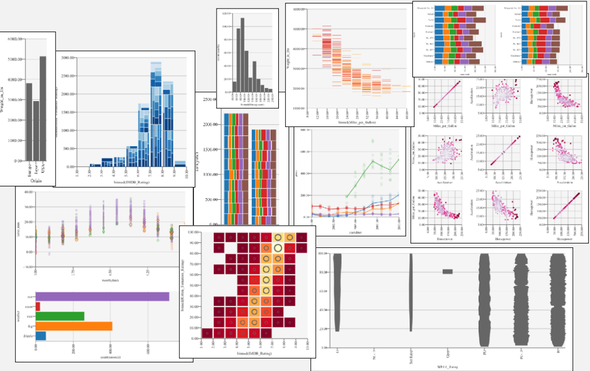
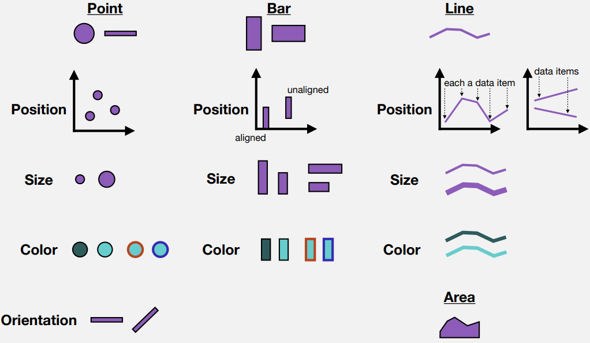
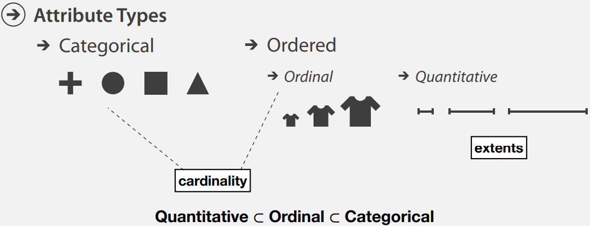
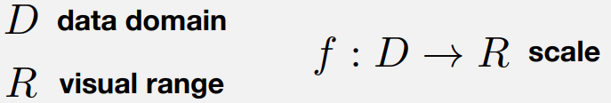
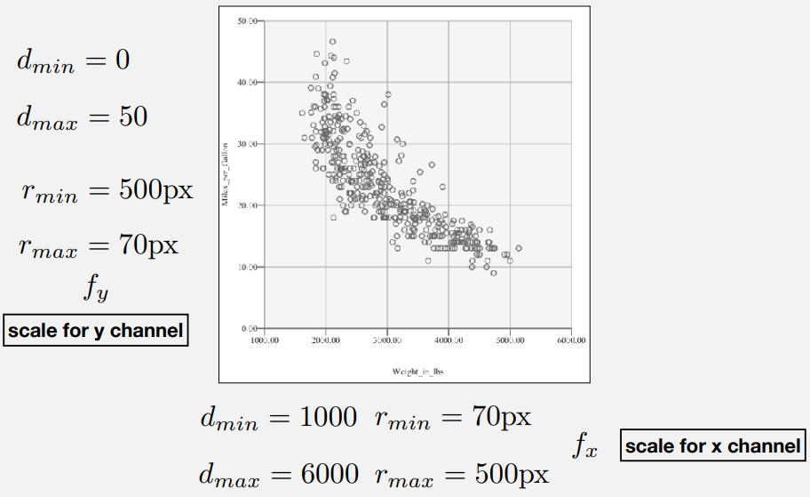
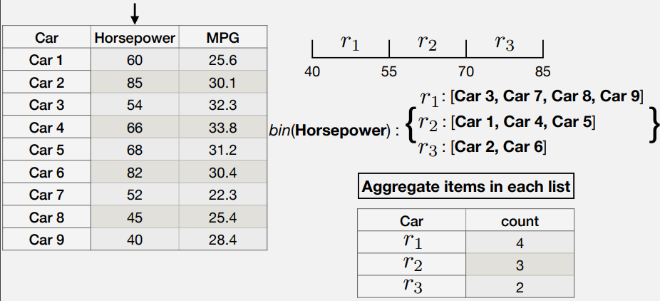
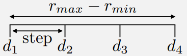
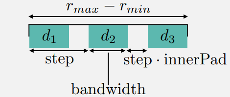
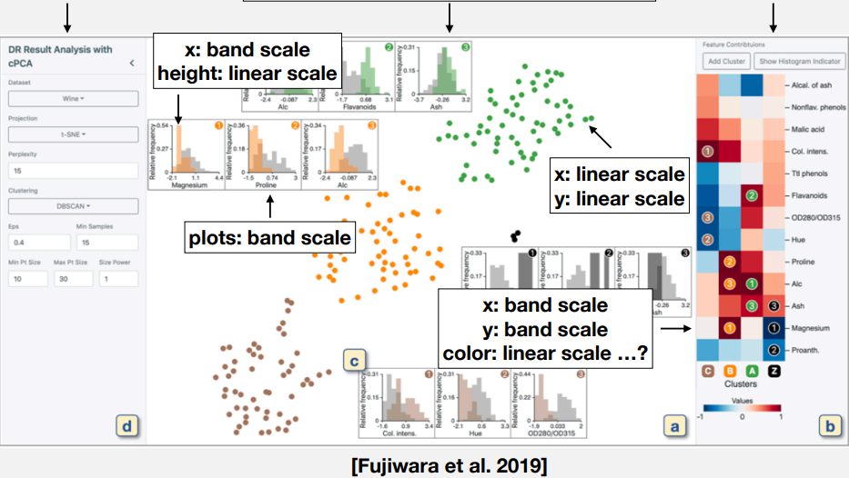

## Chart as Design

::: columns
::: {.column width="50%"}
<figure align="center">
    
</figure>
:::

::: {.column width="50%"}
<figure align="center">
    
</figure>
:::

:::

* Visualization design: more than just a typology of
visualizations

## Space of visualizations

<figure align="center">
    
</figure>

## Designing with <u>Data</u> and <u>Graphics</u>

* We will take a more granular approach to authoring
visualizations
* Each data item is encoded by a graphical mark
* How we draw the mark is dependent on the data item’s
attributes, or fields.
* A structured approach to graphics creation helps us
understand the design space

## Declarative Approach to Design

* Choose a mark  
   
* For each attribute:  
  • Determine the attribute’s type  
  • Choose a visual channel  
      
  • Choose a mapping: from data domain to visual range  
  • … draw it!  
  • (there are some variations to this approach)
  
  
## Graphical Marks, Visual Channels

<figure align="center">
    
</figure>
  

## Data: Attributes

* Starting from data, how do we go to graphics?  
* First, need to determine a data item’s attribute.  

<figure align="center">
    
</figure>

## Scales

* Next: we choose a mapping from data domain, to visual range. A **scale**. 

<figure align="center">
    
</figure>

* We distinguish scales via data attributes. Data domain or visual range can be <u>categorical</u>, <u>ordinal</u>, or <u>quantitative</u>.

## Quantitative: Quantitative Linear Scale

* Domain and range are both quantitative. We first consider a linear **scale**.  
* Mathematical preliminaries:
  * Assume data domain has a minimum and maximum value  
    $$ d_{min} \rightarrow d_{max}$$
  
  * Assume data range has a minimum and maximum value  
    $$ r_{min} \rightarrow r_{max}$$

## Quantitative: Quantitative Linear Scale

* We seek a linear function such that:
  $$ f(d_{min}) = r_{min}$$ and  $$ f(d_{max}) = r_{max}$$

## Quantitative: Quantitative Linear Scale

* Two step process:

  * Normalize data in domain:
    $$
    \alpha(d) = \frac{d - d_{min}}{d_{max} - d_{min}}
    $$

  * Linear interpolation in the range:
    $$
    f(\alpha(d)) = (1 - \alpha(d)) . r_{min} + \alpha(d) . r_{max}
    $$
  
## Linear Scale example

<figure align="center">
    
</figure>

## Other Quantitative Scales

* Can be used for different functions, e.g. quadratic, square root, etc..
* Special scale: **log**

  $$
  \alpha(d) = \frac{log(d) - log(d_{min})}{log(d_{max}) - log(d_{min})} \\
  f(\alpha(d)) = (1 - \alpha(d)) . r_{min} + \alpha(d) . r_{max}
  $$

## Quantitative: Ordinal Quantized Scale

* Our data domain is quantitative, our visual range is discrete - and in particular, ordered.
  $$ d_{min} \rightarrow d_{max} \\
  R = [r_1, r_2, \dots, r_n]
  $$

* Common assumption: range is uniformly divided by the domain.
  $$ f(\alpha(d)) = r_i \text{ Where } i = 1 + \lfloor n.\alpha_d \rfloor $$

## Special Case: Binning Transformation

<figure align="center">
    
</figure>

## Ordinal: Quantitative Point Scale

* Our data domain is ordinal, our visual range is quantitative.
  $$ 
  D = [d_1, d_2, \dots, d_m] \text{ and } r_{min} \rightarrow r_{max}
  $$

<figure align="center">
    
</figure>

  $$ 
  step = \frac{ r_{max} - r_{min} }{m-1} \\
  f(d_i) = r_{min} + (i-1).step
  $$

## Ordinal: Quantitative Band Scale

* It is also common to introduce padding at the beginning and end.

<figure align="center">
    
</figure>

  $$
  f(d_i) = r_{min} + (i-1).step
  $$

* Used for: bar marks, group transformations.

## Example

<figure align="center">
    
</figure>

## Recap: A Recipe for Authoring Visualizations

* Ingredients:
  • Identify data items.  
  • Select data attributes.  
  • Determine a type for each attribute.  
  • Determine a graphical mark for an item.  
  • Select a visual channel for each attribute.   
  • Select a scale for each channel.  

* Reference: **A Grammar of Graphics**.

