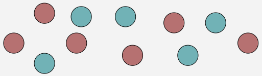
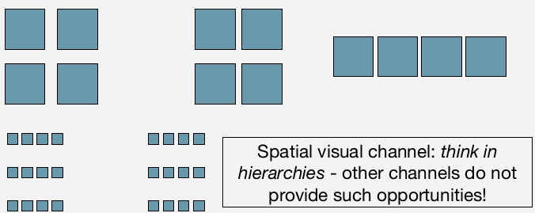
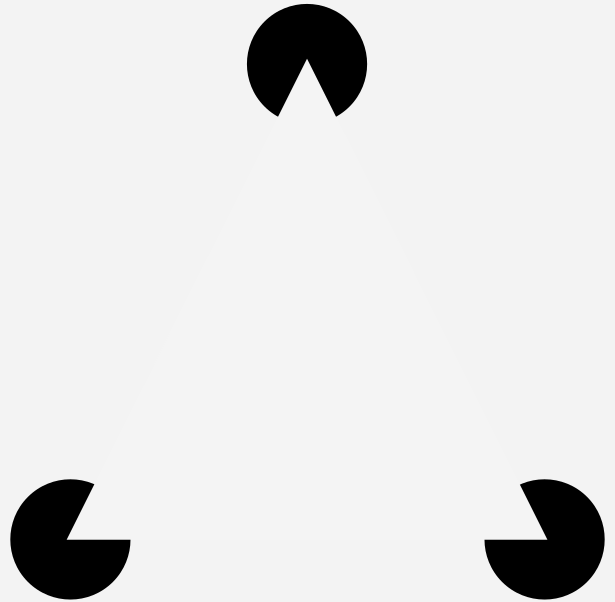
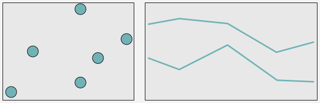
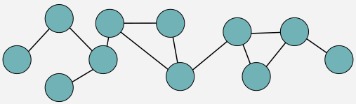
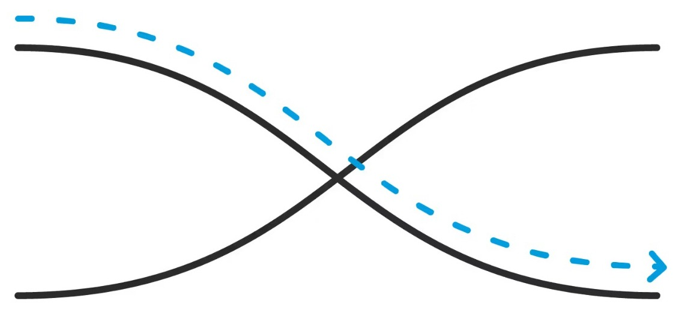
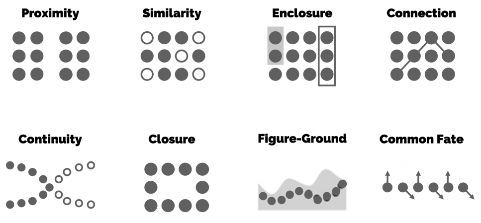

## Gestalt Laws

* How does one organize visual information?

## Gestalt Laws

* How does one organize visual information?

* Gestalt: shape/form, how we assemble visual objects into
a more uni ed whole

## Similarity

* Objects that look alike are perceived as being related.

## Similarity

* Objects that look alike are perceived as being related.

<figure align="center">
    
</figure>

## Similarity

* Objects that look alike are perceived as being related.

<figure align="center">
    
</figure>

**Implications**:
  
    - How should we visually encode nominal data?

## Proximity

* Objects that are in close spatial proximity are perceived as belonging together.

## Proximity

* Objects that are in close spatial proximity are perceived as belonging together.

* How do you group?

## Proximity

* Objects that are in close spatial proximity are perceived as belonging together.

* How do you group?

<figure align="center">
    
</figure>

## Closure

* Objects that are composed by  a set of elements which do not actually touch each other.

## Closure

* Objects that are composed by  a set of elements which do not actually touch each other.

<figure align="center">
    
</figure>

## Enclosure

* Objects that are bound by a common region perceived as belonging together.

## Enclosure

* Objects that are bound by a common region perceived as belonging together.

<figure align="center">
    
</figure>

## Enclosure

* Objects that are bound by a common region perceived as belonging together.

<figure align="center">
    
</figure>

**Implications**:
  
    - Ensure sufficient discrimination between your plots.  
    - Don’t let marks “float in space”.

## Connectedness

* Objects that are visually connected in some form are perceived as related.

## Connectedness

* Objects that are visually connected in some form are perceived as related.

<figure align="center">
    
</figure>

## Connectedness

* Objects that are visually connected in some form are perceived as related.

<figure align="center">
    
</figure>

**Implications**:
  
    - Encode graph, networks, clusters, or groups in general.
    

## Continuity

* Objects that are perceive as a single uninterrupted object when intersect.
    

## Continuity

* Objects that are perceive as a single uninterrupted object when intersect.

<figure align="center">
    
</figure>

## Summary

<figure align="center">
    
</figure>

Among others ...

## References

Great example of Interaction designs!

[video link](https://www.interaction-design.org/literature/topics/gestalt-principles)

