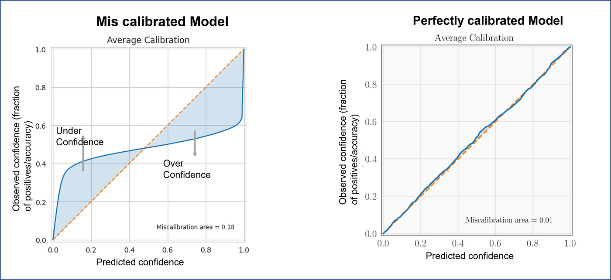
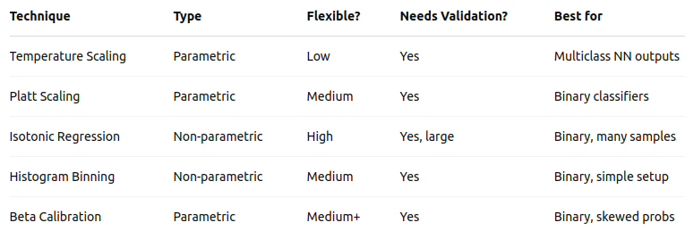
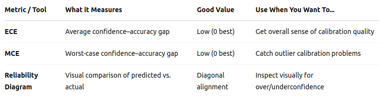

## What do we mean by model calibration?

* Model calibration is all about ensuring that a model’s predicted probabilities reflect true likelihoods.

## What do we mean by model calibration?

* Model calibration is all about ensuring that a model’s predicted probabilities reflect true likelihoods.

* In other words, a well-calibrated model gives probabilities that match the actual outcomes.

## What do we mean by model calibration?

* Model calibration is all about ensuring that a model’s predicted probabilities reflect true likelihoods.

* In other words, a well-calibrated model gives probabilities that match the actual outcomes.

In summary, if your model says something has a 70% chance of happening, that event should actually happen about 70% of the time over many such predictions.

## Example

We have two classifiers:

* **Model A**: 90% accuracy, 0.91 confidence in each prediction.  
* **Model B**: 90% accuracy, 0.99 confidence in each prediction.

Which is better?

## Example

We have two classifiers:

* **Model A**: 90% accuracy, 0.91 confidence in each prediction.  
* **Model B**: 90% accuracy, 0.99 confidence in each prediction.

Which is better?

Well, Model A is better because if a model is 90% accurate in its prediction(correctly predicting 9 out of 10 samples) then its confidence should be 90% too.

## Example

What happen with Model B?

## Example

What happen with Model B?

- Model B is overconfident, as its confidence is 99% but the accuracy is 90%

## Example

What happen with Model B?

- Model B is overconfident, as its confidence is 99% but the accuracy is 90%

On the other hand, if there was a Model C with an accuracy of 90% and 0.8 confidence in each prediction.

## Example

What happen with Model B?

- Model B is overconfident, as its confidence is 99% but the accuracy is 90%

On the other hand, if there was a Model C with an accuracy of 90% and 0.8 confidence in each prediction.

- Model C is underconfident.

## Example

By definition, We say that a model is well calibrated when a prediction of a class with confidence p is correct 100p % of the time.

Otherwise, a underconfident and overconfident models are called **ill-calibrated**.

## Example

Below is the reliability plot (discussed further section) of an ill-calibrated and well-calibrated model: 

<figure align="center">
    
</figure>

## Example

Below is the reliability plot (discussed further section) of an ill-calibrated and well-calibrated model: 

<figure align="center">
    
</figure>

This means, a model has a lot of false negatives!!

## Why is it important?

* **Trustworthy predictions** – especially in high-stakes areas like healthcare, legal decisions, or autonomous driving.

## Why is it important?

* **Trustworthy predictions** – especially in high-stakes areas like healthcare, legal decisions, or autonomous driving.

* **Better decision-making** – when probabilities are used to trigger actions (like alerts or interventions).

## Why is it important?

* **Trustworthy predictions** – especially in high-stakes areas like healthcare, legal decisions, or autonomous driving.

* **Better decision-making** – when probabilities are used to trigger actions (like alerts or interventions).

* **Uncertainty estimation** – useful in downstream tasks like ensembling, active learning, or Bayesian inference.

## Example

Covid detection model where if the confidence is higher than 90%, the patient is sent to the doctor.

## Example

Covid detection model where if the confidence is higher than 90%, the patient is sent to the doctor.

- If the model is overconfident, most of the patients will be sent to doctors, further increasing the workload.  

## Example

Covid detection model where if the confidence is higher than 90%, the patient is sent to the doctor.

- If the model is overconfident, most of the patients will be sent to doctors, further increasing the workload.  
- If the model is underconfident, then there are chances that the COVID-19 patient does not get the required treatment.

## Techniques: Temperature Scaling: 
  * Used in multiclass neural networks.
  * Applies a single scalar temperature to soften logits before softmax.
  * T is learned using a validation set to Minimize the Negative Log Likelihood (NLL).
  * When T>1, softmax become "softer" (lower confidence).
  $$\hat{p}_i = \frac{e^{z_i / T}}{\sum_j e^{z_j / T} }$$

## Techniques: Platt Scaling or Sigmoid

* Used in binary classifiers (especially SVMs).
* Fit a logistic regression to the model’s logits or scores vs. true labels.
* A and B are learned using a validation set.
$$\hat{p} = \frac{1}{1 + e^{(Az+B)}}$$

## Techniques: Histogram Binning

* Used in both binary and multiclass classification.
* Bin the predicted probabilities into fixed intervals (e.g., 0–0.1, 0.1–0.2, ...).
* Replace each prediction with the empirical accuracy of its bin.
$$\text{Calibrated } \hat{p} = \frac{\text{# correct predictions in bin}}{\text{# predictions in bin}}$$

## Techniques: Isotonic Regression

* Used in Binary classification with lots of validation data.
* Maps model scores to probabilities using a non-decreasing function.
* Divides the score range into bins, then learns a step function that best fits the true outcomes in each bin.
$$\sum_i (y_i - \hat{y}_i)^2$$

## Techniques: Beta Calibration

* When Platt Scaling is too simple but you don’t want full non-parametric complexity.
* Fits a Beta distribution-based model to scores.
* Generalizes Platt Scaling using a Beta CDF to better match score distributions.
* Learns parameters a, b, c from validation data.
$$\hat{p} = BetaCDF(az +b, c)$$

## Summary

<figure align="center">
    
</figure>

## Metrics

* Expected Calibration Error (ECE)

* Maximum Calibration Error (MCE)

* Reliability Diagrams – plot predicted vs actual probabilities.

## Expected Calibration Error (ECE)

* ECE measures the average difference between predicted confidence and actual accuracy — across bins of predictions.
* Split predictions into **M bins**, then for each **bin B**, compute accuracy and confidence:
$$ECE=\sum_{i=1}^M \frac{|B_i|}{n} |acc(B_i) - conf(B_i)|$$

* Where |B| means the number of samples in the **bin B**.
* A **lower ECE** means **better calibration**.

## Maximum Calibration Error (MCE)

* MCE focuses on the worst-case bin — the **maximum difference** between confidence and accuracy across all bins.
$$MCE = \max_{i=1}^{M} |acc(B_i) - conf(B_i)|$$

* Highlights the **largest calibration gap**.
* Useful when you care about **any** poor calibration, not just the average.

## Reliability Diagrams

* A visual tool to plot predicted probability vs. actual accuracy.

<figure align="center">
    
</figure>

## Summary

<figure align="center">
    
</figure>

## References

* [Calibration models](https://medium.com/@anuj_shah/model-calibration-a-step-towards-trustworthy-and-reliable-ai-1181f2fef2c3)
* [Model calibrations](https://blmoistawinde.github.io/ml_equations_latex/)

