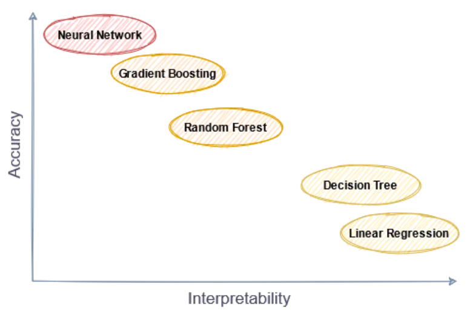
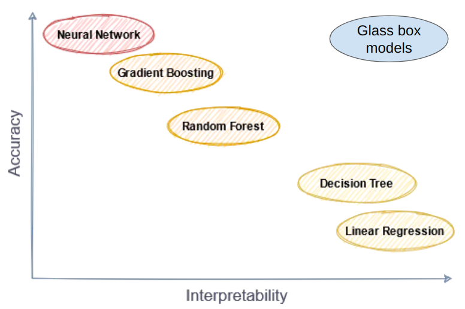
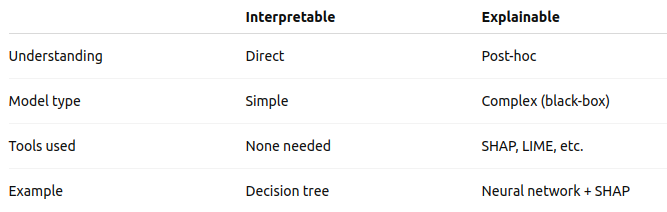
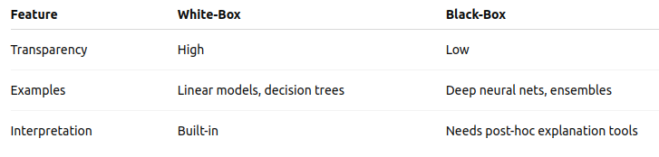
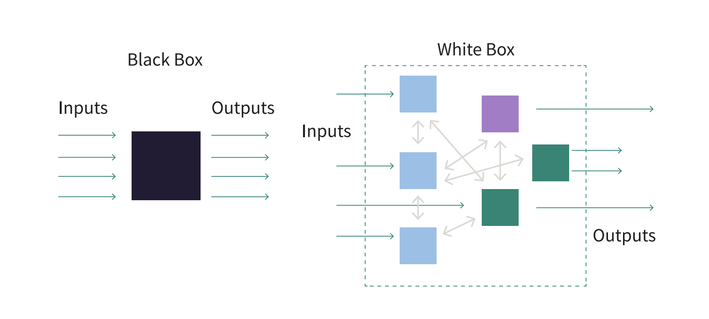

## Why Interpretability matters?

## Why Interpretability matters?

* Decision-making in high-stakes domains (healthcare, law, finance)

## Why Interpretability matters?

* Decision-making in high-stakes domains (healthcare, law, finance)
* Trust, accountability, and ethical AI

## Why Interpretability matters?

* Decision-making in high-stakes domains (healthcare, law, finance)
* Trust, accountability, and ethical AI
* Legal compliance (e.g., GDPR: "right to explanation")

## Why Interpretability matters?

* Decision-making in high-stakes domains (healthcare, law, finance)
* Trust, accountability, and ethical AI
* Legal compliance (e.g., GDPR: "right to explanation")
* Quote or statistic about lack of trust in AI

## What is Interpretability?

## What is Interpretability?

* **Definition**: The degree to which a human can consistently predict the model’s output from its inputs.

## What is Interpretability?

* **Definition**: The degree to which a human can consistently predict the model’s output from its inputs.
* Intuition: "Can I understand why this decision was made?"

## What is Interpretability?

* **Definition**: The degree to which a human can consistently predict the model’s output from its inputs.
* Intuition: "Can I understand why this decision was made?"
* Example: Feature importance in linear models.

## Interpretability

* Refers to how understandable a model is by itself.

## Interpretability

* Refers to how understandable a model is by itself.
* It's about the transparency of the model.

## Interpretability

* Refers to how understandable a model is by itself.
* It's about the transparency of the model.
* You can look at the model and directly understand how it makes decisions.

## Interpretability

* Refers to how understandable a model is by itself.
* It's about the transparency of the model.
* You can look at the model and directly understand how it makes decisions.
* Typically applies to **simple** models like: Linear regression, Decision Trees, etc.

## Accuracy - Interpretability Tradeoff

<figure align="center">
    
</figure>

## Glass boxes

<figure align="center">
    
</figure>

## Interpretable vs Explainable

## Interpretable vs Explainable

* Explainable: Refers to the ability to explain the behavior of a (possibly complex or opaque) model to humans.

## Interpretable vs Explainable

* Explainable: Refers to the ability to explain the behavior of a (possibly complex or opaque) model to humans.

<figure align="center">
    
</figure>

## What Is a White-Box Model?

## What Is a White-Box Model?

* **Definition**: A model whose internal workings are fully visible and understandable.

## What Is a White-Box Model?

* **Definition**: A model whose internal workings are fully visible and understandable.
* Intuition: is a type of machine learning model whose **internal logic**, **structure**, and **decision-making** process are fully **transparent** and **understandable** to humans.

## White-Box Model - characteristics

* You can see exactly how inputs are transformed into outputs.

## White-Box Model - characteristics

* You can see exactly how inputs are transformed into outputs.
* They are typically interpretable by design.

## White-Box Model - characteristics

* You can see exactly how inputs are transformed into outputs.
* They are typically interpretable by design.
* Easier to debug, audit, and trust.

## When to Use White-Box Models?

## When to Use White-Box Models?

* When interpretability is critical (transparent process)

## When to Use White-Box Models?

* When interpretability is critical (transparent process)
* Small or medium-sized datasets (easy to analyze)

## When to Use White-Box Models?

* When interpretability is critical (transparent process)
* Small or medium-sized datasets (easy to analyze)
* Proof-of-Concept test (understands the problem)

## White-Box vs Black-Box Models

## White-Box vs Black-Box Models

* Blax-Box Models: is a type of machine learning model whose internal workings are not easily understandable by humans, even if you have access to the code or parameters.

<figure align="center">
    
</figure>

## White-Box vs Black-Box Models

<figure align="center">
    
</figure>

## Summary

* Interpretable ML is essential for transparency and trust.
* White-box models are inherently interpretable and useful in critical settings.

## References

* [Interpret code](https://interpret.ml/docs/dt.html)
* [Interpretable ML book](https://christophm.github.io/interpretable-ml-book/).

