## Remember 

* Interpretable AI describes how it makes the prediction (simple model).  
* White-box model is one where the internal structure and logic are accessible for inspection and analysis.  

## Remember 

* Interpretable AI describes how it makes the prediction (simple model).  
* White-box model is one where the internal structure and logic are accessible for inspection and analysis.  

* Explainable AI describes why the AI model made a prediction (complex models).  
* Black-box model is one where the internal workings are unknown, , focusing on input and output relationships.


## Why Do We Need Explainability?


## Why Do We Need Explainability?

* ML models are increasingly used in critical areas (healthcare, law, finance).

## Why Do We Need Explainability?

* ML models are increasingly used in critical areas (healthcare, law, finance).  
* Many high-performing models (e.g., neural nets, ensembles) are black boxes.


## Why Do We Need Explainability?

* ML models are increasingly used in critical areas (healthcare, law, finance).  
* Many high-performing models (e.g., neural nets, ensembles) are black boxes.
* We need to trust, understand, and validate model complex decisions.

## What is a Black Box Model?

## What is a Black Box Model?

* Complex models with high predictive power but low interpretability
* Cannot easily explain why a decision was made.

## What is Explainability?

## What is Explainability?

* Ability to describe the internal mechanics of a system in human-understandable terms

## What is Explainability?

* Ability to describe the internal mechanics of a system in human-understandable terms  
* Types:
    * **Global explainability**: Understand model behavior overall

## What is Explainability?

* Ability to describe the internal mechanics of a system in human-understandable terms  
* Types:
    * **Global explainability**: Understand model behavior overall
    * **Local explainability**: Explain individual predictions

## Popular XAI Techniques

* Model-specific vs. Model-agnostic

## Popular XAI Techniques

* Model-specific vs. Model-agnostic
* Global vs. Local methods


## Model-specific vs. Model-agnostic

## Model-specific vs. Model-agnostic

* **Model-specific** methods leverage the internal structure of a model. 


## Model-specific vs. Model-agnostic

* **Model-specific** methods leverage the internal structure of a model. 

For example, you can analyze decision paths in a decision tree or weights in a linear model. However, these methods only work for that specific model type.

## Model-specific vs. Model-agnostic

* **Model-specific** methods leverage the internal structure of a model. 

For example, you can analyze decision paths in a decision tree or weights in a linear model. However, these methods only work for that specific model type.

* **Model-agnostic** methods treat the model as a black box: they don’t rely on internal workings. Instead, they use inputs and outputs to infer how the model behaves. 


## Model-specific vs. Model-agnostic

* **Model-specific** methods leverage the internal structure of a model. 

For example, you can analyze decision paths in a decision tree or weights in a linear model. However, these methods only work for that specific model type.

* **Model-agnostic** methods treat the model as a black box: they don’t rely on internal workings. Instead, they use inputs and outputs to infer how the model behaves. 

For example, you can analyze how predictions change in response to changes in input, without needing to inspect the internal logic.

## Interpreting Black Box Models

Tabular explanations:

:::: {.columns}

::: {.column width="50%"}
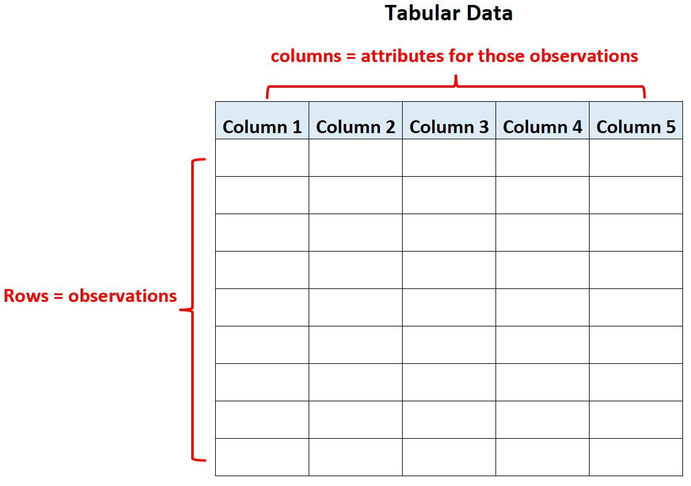
:::

::: {.column width="50%"}
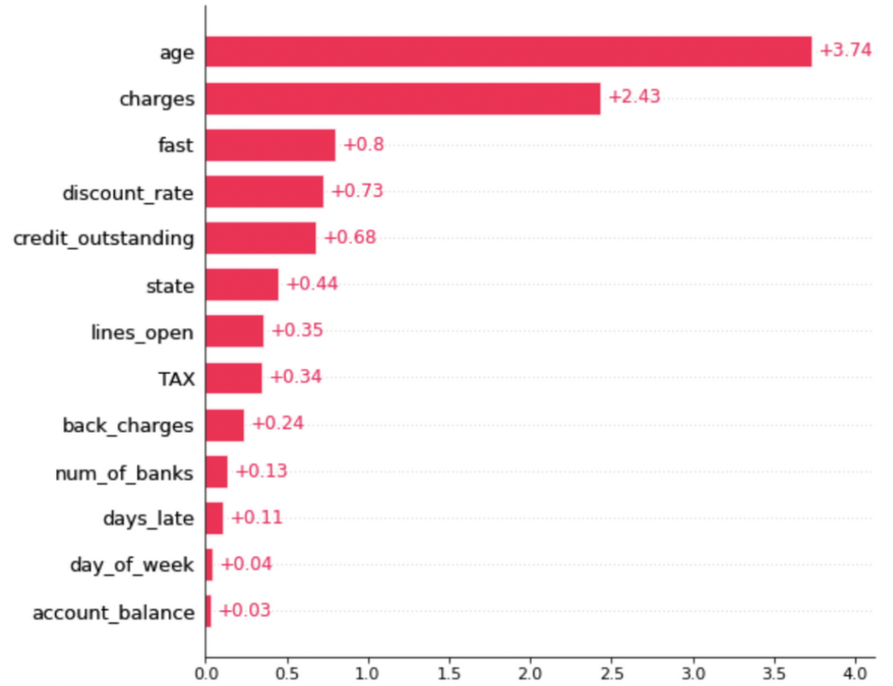
:::

::::


## Interpreting Black Box Models

Textual explanations:

<figure align="center">
    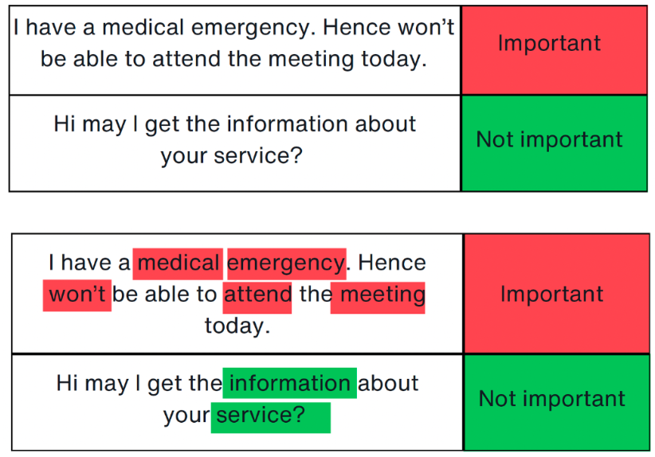
</figure>

## Interpreting Black Box Models

Image explanations:

<figure align="center">
    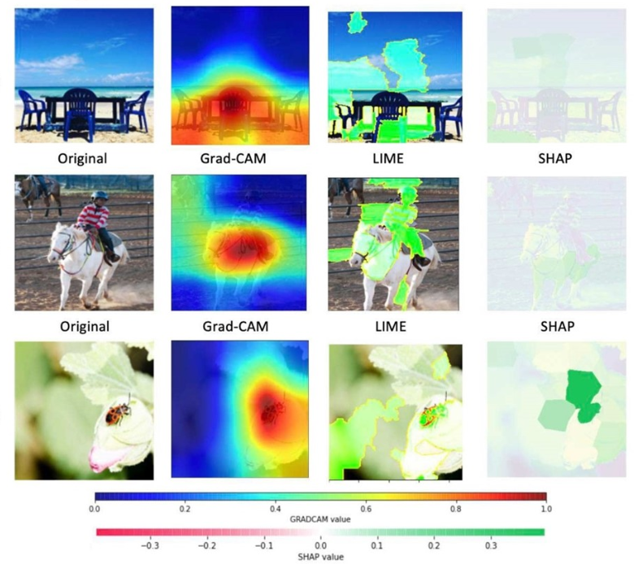
</figure>


## Interpreting Black Box Models

* Key methods for tabular data:
  - LIME (Local Interpretable Model-Agnostic Explanations)
  - SHAP (SHapley Additive exPlanations)
  

## Interpreting Black Box Models

* Key methods for tabular **& textual** data:
  - LIME (Local Interpretable Model-Agnostic Explanations)
  - SHAP (SHapley Additive exPlanations)
  

## Interpreting Black Box Models

* Key methods for tabular **& textual** data:
  - LIME (Local Interpretable Model-Agnostic Explanations)
  - SHAP (SHapley Additive exPlanations)
  
* Key methods for image data:
  - LIME (Local Interpretable Model-Agnostic Explanations)
  - SHAP (SHapley Additive exPlanations)
  - CAM (Class Activation MAps)
  

## Local Interpretable Model-Agnostic Explanations (LIME)

* What is LIME?
  

## Local Interpretable Model-Agnostic Explanations (LIME)

* What is LIME?
  * LIME is a python library that explains the prediction of any classifier by learning an interpretable model locally around the prediction
  

## Local Interpretable Model-Agnostic Explanations (LIME)

* What is LIME?
  * LIME is a python library that explains the prediction of any classifier by learning an interpretable model locally around the prediction

* Why is LIME a good model explainer?
  

## Local Interpretable Model-Agnostic Explanations (LIME)

* What is LIME?
  * LIME is a python library that explains the prediction of any classifier by learning an interpretable model locally around the prediction

* Why is LIME a good model explainer?
  * Interpretable by non-experts
  * Local fidelity (replicates the model’s behavior in the vicinity of the instance being predicted)
  * Model agnostic (does not make any assumptions about the model) 
  * Global perspective (when used on a representative set, LIME can provide a global intuition of the model)

::: footer
Ref: @Sharma_2020
:::

## How does LIME work?

* It explains the prediction of any black-box classifier by approximating it locally with an interpretable model.  

* Key ideas:
  * Focus on a **single prediction** (local explanation).
  * Creates **perturbed samples** around the input instance.
  * Observes **how predictions change**.  
  * Trains a **simple**, interpretable model (e.g., linear regression) to mimic the complex model in that local region.
  

## Objective Function

LIME solves the following optimization problem:

$\epsilon(x) = \underset{g \in G}{\mathrm{argmin }} \text{  } \mathcal{L}(f, g, \pi_x) + \Omega(g)$
  
## Objective Function

LIME solves the following optimization problem:

$\epsilon(x) = \underset{g \in G}{\mathrm{argmin }} \text{  } \mathcal{L}(f, g, \pi_x) + \Omega(g)$

Where:  
 
* $x$ is the input instance to be explained.  
* f: the original complex (black-box) model.  
* g: the interpretable surrogate model (e.g., linear model)
* G: the family of interpretable models.  


  
## Objective Function

LIME solves the following optimization problem:

$\epsilon(x) = \underset{g \in G}{\mathrm{argmin }} \text{  } \mathcal{L}(f, g, \pi_x) + \Omega(g)$

Where:  
 
* $\mathcal{L}(f, g, \pi_x)$ is the **local fidelity loss**: how well g approximates f around x, weighted by $\pi_x$ (squared error loss).  
* $\pi_x(z)$: proximity measure — how close perturbed sample z is to x (tipically exponential kernel).  
* $\Omega(g)$: complexity penalty to ensure interpretability (e.g., limit number of non-zero coefficients), usually rigde or lasso.


## LIME: surrugate model

A surrogate model is a simpler, interpretable model that is trained to approximate the predictions of a more complex (black-box) model — especially in a specific region of the input space.


## LIME: surrugate model

A surrogate model is a simpler, interpretable model that is trained to approximate the predictions of a more complex (black-box) model — especially in a specific region of the input space.

* The surrogate model is typically a linear model or a decision tree.  
* It is not used to make actual predictions in production.  
* Its sole purpose is to help explain how the black-box model behaves around a specific input.  

## LIME: surrugate model

A surrogate model is a simpler, interpretable model that is trained to approximate the predictions of a more complex (black-box) model — especially in a specific region of the input space.

<figure align="center">
    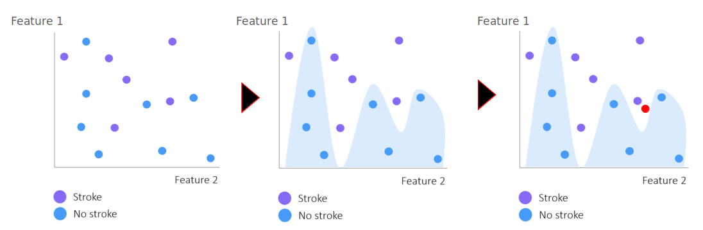
</figure>

## LIME: surrugate model

A surrogate model is a simpler, interpretable model that is trained to approximate the predictions of a more complex (black-box) model — especially in a specific region of the input space.

<figure align="center">
    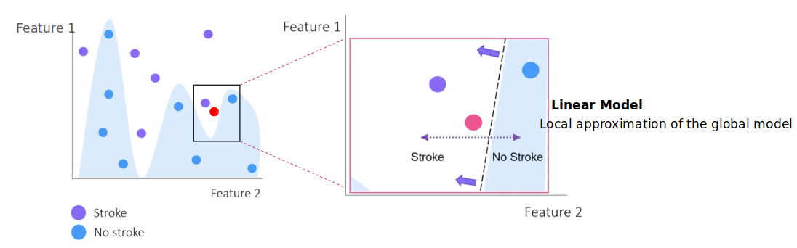
</figure>


## LIME Example in Python

We first import the relevant libraries:

``` {python}
import pandas as pd, numpy as np
from sklearn import datasets
from sklearn.decomposition import PCA
from matplotlib import pyplot as plt
from sklearn.ensemble import RandomForestClassifier
from sklearn.metrics import accuracy_score, precision_score, recall_score
from sklearn.model_selection import train_test_split
import lime, lime.lime_tabular, shap
```

## LIME Example in Python

Recall the Iris dataset, which contains flowers that can be sorted into 3 subspecies classes based on 4 features: 

``` {python}
data = datasets.load_iris()

X = pd.DataFrame(data.data, columns=data.feature_names)
y = data.target

X[0:3]
```

## LIME Example in Python

We ignore Class 0 for now (we will see why shortly), and split the data into a training set (80%) and test set (20%):

``` {python}
#Ignoring one of the three classes

X = X[y != 0]
y = y[y != 0]

X_train, X_test, y_train, y_test = train_test_split(X, y, test_size=0.20, random_state=42)
```

## LIME Example in Python

We train a random forest classifier on our training set, and generate predictions for our test set:

``` {python}
classifier = RandomForestClassifier(random_state=42)

classifier.fit(X_train, y_train)

predicted = classifier.predict(X_test)

pre  = precision_score(y_test, predicted)
rec  = recall_score(y_test, predicted)
acc = accuracy_score(y_test, predicted)

print("Precision: ", pre)
print("Recall: ", rec)
print("Accuracy: ", acc)
```

## LIME Example in Python

We use lime to create an explainer based on our training set, and generate an explanation for the 10th sample in our test set:

``` {python}
explainer1 = lime.lime_tabular.LimeTabularExplainer(X_train.values,
                                                   feature_names=X_train.columns.values.tolist(),
                                                   class_names=['class 1', 'class 2'],
                                                   verbose=True,
                                                   mode='classification',
                                                   random_state=42)

lime_values = explainer1.explain_instance(X_test.values[10], classifier.predict_proba, num_features=4)
##some lime_values properties intercept, local_pred, score
```

## LIME Example in Python

<ul >
<li style="font-size:30px";>We see that this explanation has three parts:
  <ul>
    <li style="font-size:25px";>On the left, we see that the classifier estimated there was a 78% chance the sample was from Class 1, and a 22% chance the sample was from Class 2</li>
    <li style="font-size:25px";>In the center, we see that petal length and width increased the proability that the sample was from Class 1, while sepal length and width increased the proability that the sample was from Class 2. Petal length and width also had greater influence on their respective increase than sepal length and width</li>
    <li style="font-size:25px";>On the right, we see the actual LIME values for each feature. The color of each row corresponds to the class that feature is "voting for"</li>
   </ul>
</li>
</ul>

``` {python}

lime_values.show_in_notebook()
```

## Summary

LIME for Tabular data:

<figure align="center">
    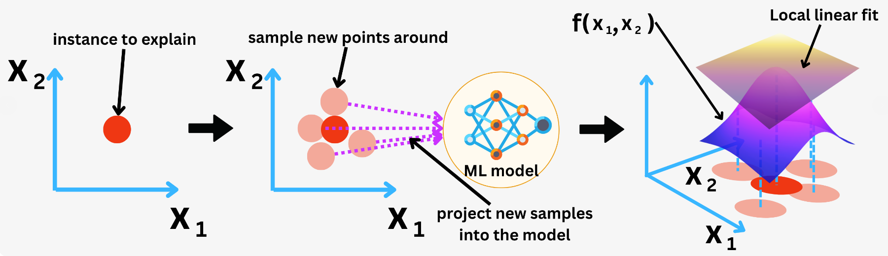
</figure>

## Summary

LIME for Text data:

<figure align="center">
    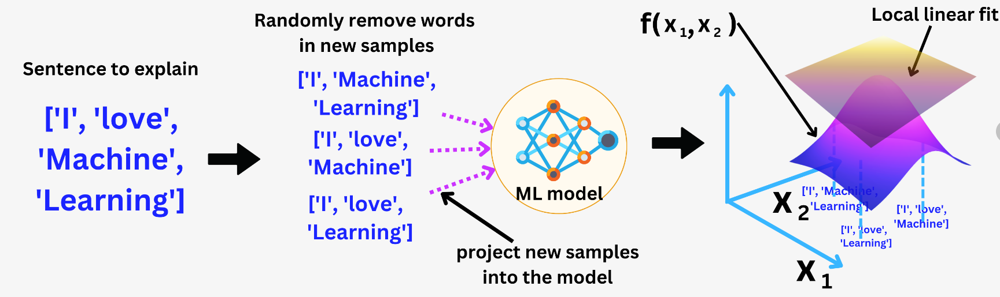
</figure>

## Summary

LIME for Image data:

<figure align="center">
    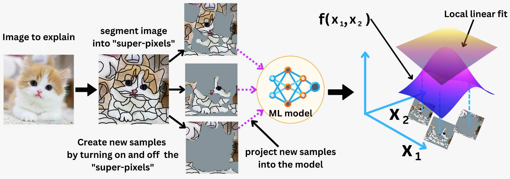
</figure>


## Class Activation Maps (CAM) 

* What is CAM?

## Class Activation Maps (CAM) 

* What is CAM?
  * CAM is a technique used to visualize which parts of an input image (typically in CNNs) are important for a particular class prediction.


## Class Activation Maps (CAM) 

* What is CAM?
  * CAM is a technique used to visualize which parts of an input image (typically in CNNs) are important for a particular class prediction.

* Why is CAM a good model explainer?

## Class Activation Maps (CAM) 

* What is CAM?
  * CAM is a technique used to visualize which parts of an input image (typically in CNNs) are important for a particular class prediction.

* Why is CAM a good model explainer?
  * Visual Interpretability by non-experts  
  * Class-Specific Explanations  
  * No Need for Model Re-training  
  * Model agnostic (does not make any assumptions about the model)  
  * Local perspective (CAM generates different activation maps for each predicted class, helping to understand why a certain class was chosen over others).  

## How does CAM work?

* Works only for CNN architectures ending in Global Average Pooling (GAP) + Fully Connected Layer.  

## How does CAM work?

* Works only for CNN architectures ending in Global Average Pooling (GAP) + Fully Connected Layer.  
* Each feature map is spatially averaged and weighted by class-specific weights to generate a heatmap.

## Objective Function

CAM calculates most important features following the equation:

$CAM_c = \sum_k w_k^c F_k$

## Objective Function

CAM calculates most important features following the equation:

$CAM_c = \sum_k w_k^c F_k$

Where:
 
* $CAM_c$: is the activation map for class c.  
* $w_k^c$: weight for class c from the final fully connected layer corresponding to feature map k.  
* $F_k$: is the GAP applied over the all features map $F_k$.  
  Global Average Pooling: $F_k=\frac{1}{Z} \sum_i \sum_j A_k(i,j)$  
  where Z is the number of pixels in feature map.  
  $A_k$: is the feature map k from a selected convolution layer.  


## CAM: general overview

<figure align="center">
    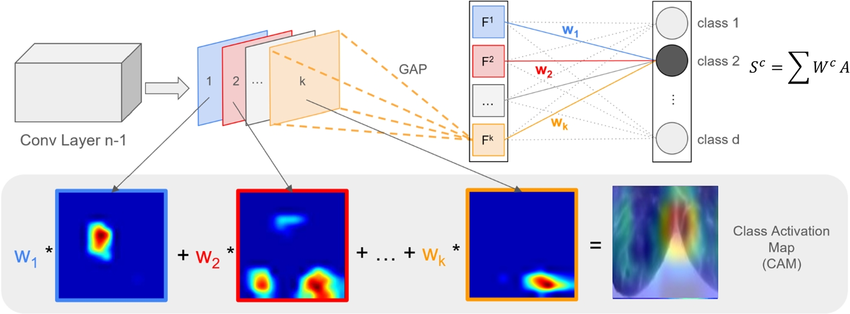
</figure>

## CAM: general overview

<figure align="center">
    
</figure>


**Limitation**: requires a specific architecture (GAP + FC layer) and cannot be applied to most pre-trained CNNs directly.


## Grad-CAM (Gradient-weighted CAM)

* What is Grad-CAM?


## Grad-CAM (Gradient-weighted CAM)

* What is Grad-CAM?
  * Grad-CAM is a more general and flexible extension of CAM.
  It uses the gradients of any target class flowing into a convolutional layer to produce a heatmap, showing which image regions influence the class prediction.
  
  
## Grad-CAM (Gradient-weighted CAM)

* What is Grad-CAM?
  * Grad-CAM is a more general and flexible extension of CAM.
  It uses the gradients of any target class flowing into a convolutional layer to produce a heatmap, showing which image regions influence the class prediction.
  
* Why is grad-CAM a better model explainer?
  
  
## Grad-CAM (Gradient-weighted CAM)

* What is Grad-CAM?
  * Grad-CAM is a more general and flexible extension of CAM.
  It uses the gradients of any target class flowing into a convolutional layer to produce a heatmap, showing which image regions influence the class prediction.
  
* Why is grad-CAM a better model explainer?
  * Works with **any CNN-based architecture**, including ResNet, VGG, etc.  
  * Can be used to **explain both classification and regression** tasks (with adaptation)  
  * Widely used for **visual model debugging**, **trust building**, and **bias detection**. 


## Grad-CAM: general overview

<figure align="center">
    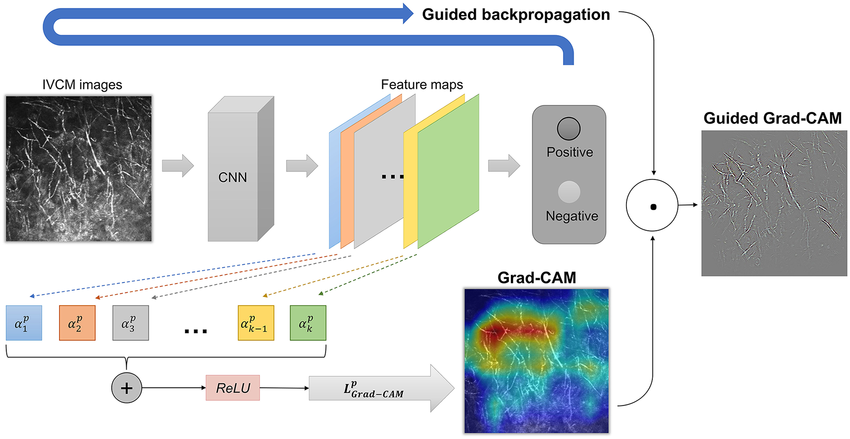
</figure> 

## Grad-CAM

Calculates most important features using the backpropagation gradients:

$\mathcal{L}_c ^{Grad-CAM} = ReLU(\sum_k w^c _k A_k)$

Where:
 
* $\mathcal{L}_c ^{Grad-CAM}$: the Grad-CAM heatmap for class c.  
* $A_k$: feature map k from a selected convolution layer.  
* $w^c_k$: importance weight of feature map k for class c, computed by:
  $w^c_k = \frac{1}{Z} \sum_i \sum_j \frac{\partial y^c}{\partial A_k(i,j)}$  
  were Z is the number of pixels in feature map.  
* $y^c$: score for class c (before softmax).  
  $y^c = \sum_k w^c_k \sum_i \sum_j A_k(i,j)$


## Grad-CAM++

Improves Grad-CAM by capturing **multiple object occurrences** in the same image.  
It uses higher-order gradients to give better spatial localization.

**Equation**:

$\mathcal{L}_c ^{Grad-CAM++} = ReLU(\sum_k w^c_k A_k)$  

Where:

* $w^c_k$: importance weight of feature map k for class c, computed by:
  $w^c_k = \sum_i \sum_j \alpha^{c}_k(i,j) ReLU(\frac{\partial y^c}{\partial A_k(i,j)})$  
  Where $\alpha^{c}_k(i,j)$ is the weighting co-efficients for the pixel-wise gradients for class c and convolutional feature map $A_k$.  
  $\alpha^{c}_k(i,j) = \frac{(\frac{\partial S^c}{\partial A^k(i,j)})^2}{ 2 (\frac{\partial S^c}{\partial A^k(i,j)})^2 + \sum_a \sum_b A_k(a,b) (\frac{\partial S^c}{\partial A^k(i,j)})^3}$
  
* $S^c$: is the penultimate layer scores for class c, computer by:
  $S^c=Ln(y^c)$


## Score-CAM

Avoids gradients completely. Instead, each activation map is used as a mask on the input image, and the **model’s output score** is used to measure importance.

**Equation**:

$\mathcal{L}_c ^{Score-CAM} = ReLU(\sum_k w^c_k A_k$)

Where:

* $w^c_k$ is the Channel-wise Increase of Confidence (CIC), computed by:  
  $w^c_k = f(x \odot Upsample(A_k)) - f(x_{baseline})$  
  where $f(x)$ is the model score for class c whe input is masked.  
  $\odot$: element-wise multiplication  
  $x_{baseline}$: uninformative reference (e.g., black image)

## Ablation-CAM

**Disables (ablates)** each feature map one by one and measures the drop in class score.
The more the drop, the more important the feature map.

**Equation**:

$\mathcal{L}_c ^{Ablation-CAM} = ReLU(\sum_k w^c_k A_k$)

Where:

* $w^c_k$: importance weight fraction of drop in activation score of class c when feature map $A_k$ is removed. Is computed by:  
  $w^c_k = \frac{y^c - y^c_k}{ ||A_k|| }$  
  Where $y^c_k$ is value of the function for absence of unit k and acts as a baseline for $A_k$.

## Layer-CAM

Instead of averaging gradients (like Grad-CAM), it uses **element-wise product of activation and gradient** — preserving **spatial information**.

**Equation**:

$\mathcal{L}_c ^{Layer-CAM} = ReLU(\sum_k  \hat{A}_k$)

Where:

* $\hat{A}_k$: is the linearly combination along the channel dimension to obtain the class activation map k.  
  Where $\hat{A}_k = \sum_i \sum_j w^c_k(i, j) A_k(i,j)$  
  Which means, it first multiplies the activation value of each location in the feature map by a weight.  
  Besides, $w^c_k(i, j) = ReLU( \frac{\partial y^c}{\partial A_k(i,j)} )$ is the weight of the spatial location $(i, j)$ in the k-th feature map.


## Eigen-CAM

Applies **PCA** to the feature maps of a convolutional layer and uses the **top principal component** as the saliency map.

**Equation**:

$\mathcal{L}_c ^{Eigen-CAM} = v^T_1 A_k'$

Where:

* $A_k'$ is the result of the covariance matrix $\Sigma = A'_k A_k^T$.  
* $v^T_1$ is the transpose of the first principal component of $A_k$


## XGrad-CAM

XGrad-CAM improves on Grad-CAM by modifying how **importance weights** for feature maps are calculated.

While **Grad-CAM** uses **global average pooling (GAP)** of gradients to obtain a weight for each feature map (i.e., channel), **XGrad-CAM** incorporates the **feature map activations themselves** into the weighting formula.

This means it computes **channel importance** based on how **both gradients and activations** contribute to the output — leading to sharper and more focused visualizations.

**Equation**:

$\mathcal{L}_c ^{XGrad-CAM} = ReLU(\sum_k w^c_k A_k$)

Where:

* $w^c_k$ is the importance of the model.  
  Where $w^c_k = \sum_i \sum_j A_k(i, j) \frac{\partial y^c}{\partial A^k(i,j)})$
* $A_k(i, j)$ is the activation map value at spatial location $(i,j)$ for channel k.  


##  There is more!!

* **Saliency Maps**: Highlights image pixels that most influence the output by computing the gradient of the class score w.r.t. the input image.
* **Integrated gradients**: Computes the average gradients as the input changes from a baseline (e.g., black image) to the actual image.   
* **Occlusion Sensitivity**: Systematically masks out patches of the image and observes how the prediction changes.  
* **RISE (Randomized Input Sampling for Explanation)**: Generates many random masks, passes masked images to the model, and weights the masks by the model output.  
* **SmoothGrad**: Averaging many noisy saliency maps created by adding Gaussian noise to the input.  
* etc.

## References

* [LIME](https://arxiv.org/abs/1602.04938)
* [SHAP](https://arxiv.org/abs/1705.07874)
* [CAM](https://arxiv.org/abs/1512.04150)
* [Grad-CAM](https://arxiv.org/abs/1610.02391)
* [Grad-CAM++](https://arxiv.org/abs/1710.11063)
* [Score-CAM](https://arxiv.org/abs/1910.01279)
* [Ablation-CAM](https://openaccess.thecvf.com/content_WACV_2020/papers/Desai_Ablation-CAM_Visual_Explanations_for_Deep_Convolutional_Network_via_Gradient-free_Localization_WACV_2020_paper.pdf)
* [Layer-CAM](/https://mftp.mmcheng.net/Papers/21TIP_LayerCAM.pdf)
* [Eigen-CAM](https://arxiv.org/abs/2008.00299)
* [XGrad-CAM](https://arxiv.org/pdf/2008.02312v4)

