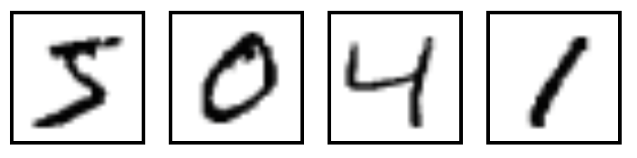
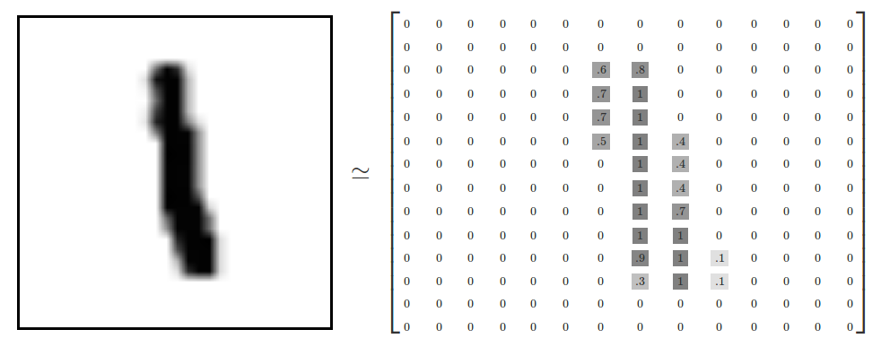
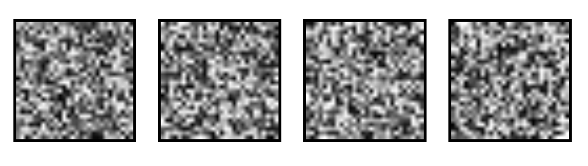
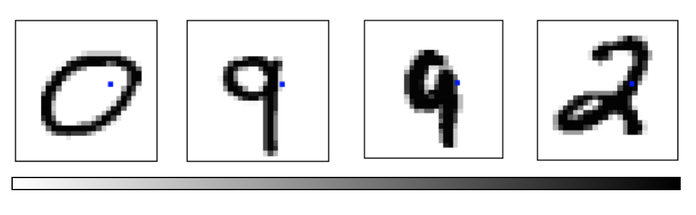
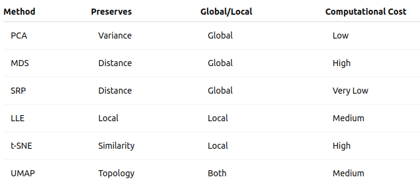

## Dimensionality Reduction

**What is Dimensionality Reduction?**


## Dimensionality Reduction

**What is Dimensionality Reduction?**

Dimensionality reduction is the process of reducing the number of random variables under consideration by obtaining a set of principal variables.  


## Dimensionality Reduction

**What is Dimensionality Reduction?**

Dimensionality reduction is the process of reducing the number of random variables under consideration by obtaining a set of principal variables.  
It helps in:  

* Visualization of high-dimensional data  
* Reducing computational cost  
* Eliminating noise and redundancy  

## Methods

* Principal Component Analysis (PCA)  
* Multidimensional Scaling (MDS)  
* Sparse Random Projection (SRP)  
* Locally Linear Embedding (LLE)  
* t-Distributed Stochastic Neighbor Embedding (t-SNE)  
* Uniform Manifold Approximation and Projection (UMAP)  

## PCA

## PCA

**Core idea**:

Based on variance maximization and eigen decomposition.


## PCA

**Core idea**:

Based on variance maximization and eigen decomposition.

**Purpose**:

Find a set of orthogonal axes (principal components) that capture the maximum variance in the data.

## PCA

**Steps**:

- Center the data.   
- Compute the covariance matrix: $\sum = \frac{1}{n} X^T X$  
- Compute the eigenvectors and eigenvalues: $\sum v_i = \lambda_i v_i$    
- Project the data onto the new: $Z = X W_k$  
  where $W_k$ are the top-k eigenvectors.


## Example on MNIST

MNIST Dataset

* Dataset of 28x28 pixel images of handwritten digits



::: footer
Ref: @Olah_2014
:::

## MNIST Dataset

<ul >
<li style="font-size:25px";>Every MNIST image can be thought of as a 28x28 array of numbers describing how dark each pixel is:
</li>
</ul>

<ul >
<li style="font-size:25px";>We can flatten each array into a 28 * 28 = 784 dimensional vector, where each component of the vector is a value between zero and one describing the intensity of the pixel
</li>
<li style="font-size:25px";>We can think of MNIST as a collection of 784-dimensional vectors
</li>
</ul>

::: footer
Ref: @Olah_2014
:::

## MNIST Dataset

* But not all vectors in this 784-dimensional space are MNIST digits! Typical points in this space are very different 
* To get a sense of what a typical point looks like, we can randomly pick a few random 28x28 images – each pixel is randomly black, white or some shade of gray. These random points look like noise:



::: footer
Ref: @Olah_2014
:::

## MNIST Dataset

<ul >
<li style="font-size:30px";>28x28 images that look like MNIST digits are very rare - they make up a very small subspace of 784-dimensional space 
<ul>
<li style="font-size:25px";>With some slightly harder arguments, we can see that they occupy a lower (than 748) dimensional subspace</li>
</ul>
</li>
<li style="font-size:30px";>Many theories about lower-dimensional structure of MNIST (and similar data)
  <ul>
    <li style="font-size:25px";>Manifold hypothesis (popular among ML researchers): MNIST is a low dimensional manifold curving through its high-dimensional embedding space</li>
    <li style="font-size:25px";>Another hypothesis (rooted in topological data analysis) is that data like MNIST consists of blobs with tentacle-like protrusions sticking out into the surrounding space</li>
    <li style="font-size:25px";>But no one actually knows for sure!</li>
   </ul>
</li>
</ul>

::: footer
Ref: @Olah_2014
:::

## MNIST Cube

<ul>
  <li style="font-size:30px";>Imagine the MNIST data points as points suspended in a 784-dimensional cube
  <ul>
    <li style="font-size:25px";>Each dimension of the cube corresponds to a particular pixel</li>
    <li style="font-size:25px";>The data points range from zero to one according to pixel intensity</li>
    <li style="font-size:25px";>On one side of the dimension, there are images where that pixel is white. On the other side of the dimension, there are images where it is black. In between, there are images where it is gray.</li>
   </ul>
</li>
<li style="font-size:30px";>What does this cube look like if we look at a particular two-dimensional face? Let's look at Olah's visualizations.
</li>
</ul>



::: footer
Ref: @Olah_2014
:::

## MNIST Cube

* What qualities would the ‘perfect’ visualization of MNIST have? What should our goal be?
* What is the best way to cluster MNIST data?
* We can try what we learned last week...

::: footer
Ref: @Olah_2014
:::

## PCA on MNIST

Import libraries:

``` {python}
import numpy as np
import matplotlib.pyplot as plt
import sklearn
from sklearn.datasets import load_digits
from sklearn.decomposition import TruncatedSVD
from sklearn.discriminant_analysis import LinearDiscriminantAnalysis
from sklearn.ensemble import RandomTreesEmbedding
from sklearn.manifold import (Isomap, LocallyLinearEmbedding, MDS, SpectralEmbedding, TSNE)
from sklearn.neighbors import NeighborhoodComponentsAnalysis
from sklearn.pipeline import make_pipeline
from sklearn.random_projection import SparseRandomProjection
from sklearn.decomposition import PCA
import plotly.graph_objects as go
from umap import UMAP
```

## PCA on MNIST 

Define helper functions for visualizing clusters in 2D and 3D:

``` {python}
# Authors: Gael Varoquaux
# License: BSD 3 clause (C) INRIA 2014
def plot_clustering(X_red, labels, title=None):
    x_min, x_max = np.min(X_red, axis=0), np.max(X_red, axis=0)
    X_red = (X_red - x_min) / (x_max - x_min)

    plt.figure(figsize=(6, 6))
    for digit in digits.target_names:
        plt.scatter(
            *X_red[y == digit].T,
            marker=f"${digit}$",
            s=50,
            # c=plt.cm.nipy_spectral(labels[y == digit] / 10),
            alpha=0.5,
        )

    plt.xticks([])
    plt.yticks([])
    if title is not None:
        plt.title(title, size=17)
    plt.axis("off")
    plt.tight_layout(rect=[0, 0.03, 1, 0.95])
```

## PCA on MNIST 

Define helper functions for visualizing clusters in 2D and 3D:

``` {python}
def plot_3d_clustering(X_red, labels, title=None):
    component0 = X_red[:, 0]
    component1 = X_red[:, 1]
    component2 = X_red[:, 2]
    indices =  list(range(X_red.shape[0]))
    labels = list (map(lambda x: "label:" + str(y[x]) + ", id:" + str(x),indices))

    fig = go.Figure(data=[go.Scatter3d(
        x=component0,
        y=component1,
        z=component2,
        mode='markers',
        marker=dict(
            size=10,
            color=y,                # set color to an array/list of desired values
            colorscale='Rainbow',   # choose a colorscale
            opacity=1,
            line_width=1,
        ),
        text = labels

    )])
# tight layout
    fig.update_layout(margin=dict(l=50,r=50,b=50,t=50),width=520,height=520)
    fig.layout.template = 'plotly_dark'

    fig.show()
```

## PCA on MNIST

Load the MNIST dataset:
``` {python}
digits = load_digits(n_class=6)
X, y = digits.data, digits.target
n_samples, n_features = X.shape
n_neighbors = 30

print("Samples: " + str(n_samples))
print("Features: " + str(n_features))
```

## PCA on MNIST 

Peform PCA:

``` {python}
pca = PCA(n_components=2)
pca.fit(X)
X_trans = pca.transform(X)
print("Singular values: " + str(pca.singular_values_))
```

## PCA on MNIST 

<ul style="font-size:25px";>
We see that we are able to reasonbly cluster the data by digit using PCA:
</ul>

``` {python}
plt.scatter(X_trans[:,0],X_trans[:,1])
```

## PCA on MNIST 

<ul style="font-size:25px";>
We see that we are able to reasonbly cluster the data by digit using PCA:
</ul>

``` {python}
plot_clustering(X_trans, "", "PCA")
```

## PCA on MNIST 

<ul style="font-size:25px";>
We can also visualize this in 3D:
</ul>

``` {python}
pca_3d = PCA(n_components=3)
X_trans_3d = pca_3d.fit_transform(X)
plot_3d_clustering(X_trans_3d, "", "PCA")
```

## MDS

## MDS

It is also known as Principal Coordinates Analysis (PCoA).

## MDS

It is also known as Principal Coordinates Analysis (PCoA).

**Core idea**:

Focuses on preserving distances using eigenvalue decomposition of a similarity matrix.


## MDS

It is also known as Principal Coordinates Analysis (PCoA).

**Core idea**:

Focuses on preserving distances using eigenvalue decomposition of a similarity matrix.

**Purpose**:

Preserve pairwise distances between data points in the low-dimensional embedding.

## MDS

**Steps**:

- Compute the squared proximity matrix: $D^2 = [d^2_{ij}]$
- Double-center the distance matrix to obtain a similarity matrix:  
  $B = - \frac{1}{2} C D^2 C$  
  Where $C=I-\frac{1}{n} J_n$ is the centering matrix and $J_n = 11^T$ is the matrix of all ones.  
- Perform eigen decomposition: $B = V \Sigma V^T$  
- Use top eigenvectors as Low-dim coordinates: $X = V_k \Sigma_k ^{1/2}$  


## MDS on MNIST

``` {python}
mds = MDS(n_components=2, n_init=1, max_iter=120, n_jobs=2)
X_mds = mds.fit_transform(X)
plot_clustering(X_mds, "", "MDS")
```

## MDS on MNIST

``` {python}
mds_3d = MDS(n_components=3, n_init=1, max_iter=120, n_jobs=2)
mds_3d.fit(X)
X_mds_3d = mds_3d.fit_transform(X)
plot_3d_clustering(X_mds_3d, "", "MDS")
```

## SRP


## SRP

**Core idea**:

Projects using sparse random matrices while preserving distances.


## SRP

**Core idea**:

Projects using sparse random matrices while preserving distances.

**Purpose**:

Reduce dimensionality while approximately preserving pairwise distances using sparse random matrices.

## SRP

**Steps**:

- Generate a sparse random matrix:  
  $\mathcal{R}_{ij} = \sqrt{s} \times \begin{cases}
+1, & \text{with probability } \frac{1}{2s} \\
-1, & \text{with probability } \frac{1}{2s} \\
0, & \text{with probability } 1 - \frac{1}{s} \\
\end{cases}$  
  Where $s$ is the sparsity parameter.  
- Projects $Z = X\mathcal{R}$  


## SRP on MNIST 

``` {python}
srp=SparseRandomProjection(n_components=2, random_state=42)
X_srp=srp.fit_transform(X)
plot_clustering(X_srp, "", "Sparse Random Projection")
```

## SRP on MNIST

``` {python}
srp_3d=SparseRandomProjection(n_components=3, random_state=42)
X_srp_3d=srp_3d.fit(X)
X_srp_3d=srp_3d.fit_transform(X)
plot_3d_clustering(X_srp_3d, "", "Sparse Random Projection")
```

## LLE

## LLE

**Core idea**:

Uses local linear reconstruction weights.

## LLE

**Core idea**:

Uses local linear reconstruction weights.

**Purpose**:

Preserve local neighborhood relationships by linear reconstruction.


## LLE

**Steps**:

- Identify k-nearest neighbors for each point:  
  Minimize $\sum_i || x_i - \sum _{j \in N(i) w_{ij} x_j } ||^2$  
- Compute weights that reconstruct each point from its neighbors. 
- Find low-dimensional embeddings that preserve these weights:  
  $\Phi(Y) = \sum_i ||y_i - \sum _{j \in N(i) w_{ij} y_j } ||^2$ 

## LLE on MNIST

``` {python}
lle=LocallyLinearEmbedding(n_neighbors=5, n_components=2, method="standard")
X_lle=lle.fit(X)
X_lle=lle.fit_transform(X)
plot_clustering(X_lle, "", "LLE")
```

## LLE on MNIST

``` {python}
lle_3d=LocallyLinearEmbedding(n_neighbors=n_neighbors, n_components=3, method="standard")
X_lle_3d=lle_3d.fit(X)
X_lle_3d=lle_3d.fit_transform(X)
plot_3d_clustering(X_lle_3d, "", "LLE")
```

## t-SNE

## t-SNE

**Core idea**:

Optimizes the KL divergence between high and low-dimensional similarities.

## t-SNE

**Core idea**:

Optimizes the KL divergence between high and low-dimensional similarities.

**Purpose**:

Preserve the local structure of data based on similarity probabilities.

## t-SNE

**Steps**:

- Convert high-dimensional distances to joint probabilities:  
  $p_{ij} = \frac{p_{j|i} + p_{i|j}}{2n}$  
  Where $p_{j|i} = \frac{ exp( -|| x_i - x_j||^2 / 2 \sigma_i ^2 ) }{\sum_{k\neq i} exp( -|| x_i - x_k||^2 / 2 \sigma_i ^2 ) }$
- Define low-dimensional similarities:  
  $q_{ij} = \frac{(1+|| y_i - y_j ||^2)^{-1}}{ \sum_{k\neq l} (1+|| y_k - y_l ||^2)^{-1} }$  
- Minimize the Kullback-Leibler divergence between $p_{ij}$ and $q_{ij}$:  
  $KL = \sum _{i \neq j} p_{ij} log(\frac{p_{ij}}{q_{ij}})$


## t-SNE on MNIST

``` {python}
tsne = sklearn.manifold.TSNE()
X_tsne = tsne.fit_transform(X)
plot_clustering(X_tsne, "", "T-SNE")
```

## t-SNE on MNIST

``` {python}
tsne_3d = sklearn.manifold.TSNE(3)
X_tsne_3d = tsne_3d.fit_transform(X)
plot_3d_clustering(X_tsne_3d, "", "T-SNE")
```

## Using t-SNE Effectively
* t-SNE plots are popular and can be useful, but only if you avoid common misreadings
  * Beware of hyperparameter values
  * Remember cluster sizes in a t-SNE plot mean nothing
  * Know that distances BETWEEN clusters may not mean anything either
  * Random noise doesn't always look random
  * You may need multiple plots for topology
* See @Wattenberg_Viégas_Johnson_2016 for more details

::: footer
Ref: @Wattenberg_Viégas_Johnson_2016
:::

## UMAP

## UMAP

**Core idea**:

Uses manifold learning and minimizes a cross-entropy loss between fuzzy topological structures.

## UMAP

**Core idea**:

Uses manifold learning and minimizes a cross-entropy loss between fuzzy topological structures.

**Purpose**:

Preserve both local and global structure using manifold learning.

## UMAP

**Steps**:

- Construct fuzzy simplicial complex in high-dimensional space $p_{ij}$:  
  $p_{ij} = exp(\frac{d(x_i, x_j) - \rho_i}{\sigma_i})$  
- Construct a similar complex in low-dimensional space $q_{ij}$:  
  $q_{ij} = \frac{1}{ 1+\alpha || y_i - y_j ||^{2\beta} }$  
- Minimize the cross-entropy between $p_{ij}$ and $q_{ij}$:  
  $CE = \sum _{(i, j)} p_{ij} log(\frac{p_{ij}}{q_{ij}}) + (1 - p_{ij}) log( \frac{1-p_{ij}}{1-q_{ij}} )$

## UMAP on MNIST

``` {python}
ump=UMAP()
ump.fit(X)
X_umap=ump.fit_transform(X)
plot_clustering(X_umap, "not used", "UMAP")
```

## UMAP on MNIST

``` {python}
ump_3d=UMAP(n_components=3)
ump_3d.fit(X)
X_umap_3d = ump_3d.fit_transform(X)
plot_3d_clustering(X_umap_3d, "", "UMAP")
```

## Summary

<figure align="center">
    
</figure>

## References (Good for Further Reading)
