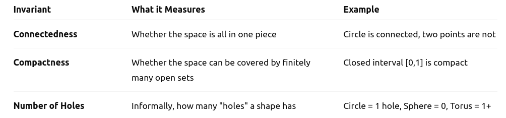
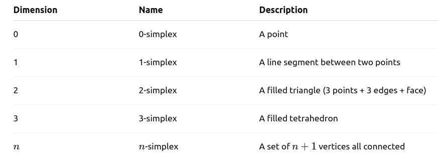

##  What is Topology?

##  What is Topology?

* Topology is the mathematical study of shape and space, focusing on properties preserved under continuous deformations (stretching, bending, but not tearing or gluing).


##  What is Topology?

* Topology is the mathematical study of shape and space, focusing on properties preserved under continuous deformations (stretching, bending, but not tearing or gluing).  
* It generalizes geometry and analysis.

## Examples

## Examples

* open/close sets

## Examples

* open/close sets  
* Continuity

## Examples

* open/close sets  
* Continuity  
* Compactness  

## Examples

* open/close sets  
* Continuity  
* Compactness  
* Connectedness  

## Topological Spaces

## Topological Spaces

A **Topological space** is a set $\mathcal{X}$ with a collection $\mathcal{T}$ of subsets satisfying:

* $\emptyset \in \mathcal{T}, \mathcal{X} \in \mathcal{T}$  
* Closed under arbitrary unions  
* Closed under finite intersections  

## Topological Spaces

A **Topological space** is a set $\mathcal{X}$ with a collection $\mathcal{T}$ of subsets satisfying:

* $\emptyset \in \mathcal{T}, \mathcal{X} \in \mathcal{T}$  
* Closed under arbitrary unions  
* Closed under finite intersections  

**Example**:  The real numbers $\mathbb{R}$ with the standard topology.


## Open Sets in Python

``` {python}
import numpy as np

# Define a basic open interval (0, 1)
X = np.linspace(0, 1, 100, endpoint=False)

# Visualize it
import matplotlib.pyplot as plt
plt.plot(X, np.zeros_like(X), 'o')
plt.title("Open interval (0,1)")
plt.show()
```

## Continuous Functions

A function $f: \mathcal{X} \rightarrow \mathcal{Y}$  is continuous if the preimage of every open set in $\mathcal{Y}$ is open in $\mathcal{X}$.

## Continuous Functions

A function $f: \mathcal{X} \rightarrow \mathcal{Y}$  is continuous if the preimage of every open set in $\mathcal{Y}$ is open in $\mathcal{X}$.  
Example: $f(x) = X^2$ is continuous in $\mathbb{R}$.

## Continuous Functions

``` {python}
import matplotlib.pyplot as plt

x = np.linspace(-2, 2, 100)
y = x**2

plt.plot(x, y)
plt.title("f(x) = x² is continuous")
plt.grid(True)
plt.show()
```

## Homeomorphism

## Homeomorphism

A homeomorphism is a bijective (one-to-one and onto), continuous function between two topological spaces, with a continuous inverse.

## Homeomorphism

A homeomorphism is a bijective (one-to-one and onto), continuous function between two topological spaces, with a continuous inverse.

* A bijective, continuous function with a continuous inverse.  
* Homeomorphic spaces are "topologically the same".  

## Homeomorphism

A homeomorphism is a bijective (one-to-one and onto), continuous function between two topological spaces, with a continuous inverse.

* A bijective, continuous function with a continuous inverse.  
* Homeomorphic spaces are "topologically the same".  

**Example**:  

* A coffee cup and a donut (torus) are homeomorphic—they both have one hole.  
* A circle and a square are homeomorphic, but a circle and a line segment are not.  

##

``` {python}
import matplotlib.pyplot as plt
import numpy as np

theta = np.linspace(0, 2 * np.pi, 100)
circle_x, circle_y = np.cos(theta), np.sin(theta)
square_x, square_y = np.sign(np.cos(theta)), np.sign(np.sin(theta))

plt.plot(circle_x, circle_y, label='Circle')
plt.plot(square_x, square_y, label='Square (homeomorphic)', linestyle='--')
plt.axis('equal')
plt.title('Homeomorphic Shapes: Circle and Square')
plt.show()
```

## Example: Topology on Graphs

``` {python}
import networkx as nx

G = nx.cycle_graph(5)
nx.draw_circular(G, with_labels=True, node_color='skyblue')
```


## Topological Invariants


## Topological Invariants

A topological invariant is a property of a topological space that remains unchanged under homeomorphisms.  
It helps to classify and distinguish different spaces.


## Topological Invariants

A topological invariant is a property of a topological space that remains unchanged under homeomorphisms.  
It helps to classify and distinguish different spaces.

<figure align="center">
    
</figure>

## Euler Characteristic (classic invariant)

## Euler Characteristic (classic invariant)

The Euler Characteristic (denoted $\mathcal{X}$) is a topological invariant — a number that describes a topological space’s shape or structure in a way that remains unchanged under continuous deformations (like stretching or bending, but not tearing or gluing).

## Euler Characteristic (classic invariant)

The Euler Characteristic (denoted $\mathcal{X}$) is a topological invariant — a number that describes a topological space’s shape or structure in a way that remains unchanged under continuous deformations (like stretching or bending, but not tearing or gluing).

$\mathcal{X} = V -E + F$

## Euler Characteristic (classic invariant)

The Euler Characteristic (denoted $\mathcal{X}$) is a topological invariant — a number that describes a topological space’s shape or structure in a way that remains unchanged under continuous deformations (like stretching or bending, but not tearing or gluing).

$\mathcal{X} = V -E + F$

Where:

* $V$: Number of vertices (corners or points)  
* $E$: Number of edges (line segments connecting vertices)  
* $F$: Number of faces (flat surfaces bounded by edges)

This formula applies to many polyhedral surfaces (like cubes, pyramids, etc.) and also generalizes to other topological spaces.

## Euler Characteristic (classic invariant)

Why is it important?


## Euler Characteristic (classic invariant)

Why is it important?

* **Topological invariant**: It doesn’t change under stretching, bending, or twisting (homeomorphisms).  


## Euler Characteristic (classic invariant)

Why is it important?

* **Topological invariant**: It doesn’t change under stretching, bending, or twisting (homeomorphisms).  
* Helps classify surfaces:
  * Sphere: $\mathcal{X} = 2$  
  * Torus (donut): $\mathcal{X} = 0$  
  * double torus: $\mathcal{X} = -2$  


## Euler Characteristic (classic invariant)

Why is it important?

* **Topological invariant**: It doesn’t change under stretching, bending, or twisting (homeomorphisms).  
* Helps classify surfaces:
  * Sphere: $\mathcal{X} = 2$  
  * Torus (donut): $\mathcal{X} = 0$  
  * double torus: $\mathcal{X} = -2$  

* Tells you about the **number of holes**:
  $\mathcal{X} = 2 - 2g$ (for a closed, orientable surface of genus g)  
  where g is the number of “holes”.  


## Relation to homology

The Euler characteristic is also the **alternating sum of Betti numbers** (from homology):

$\mathcal{X} = \beta_0 - \beta_1 + \beta_2 - \dots$

Where:

* $\beta_0$: Number of connected components  
* $\beta_1$: Number of loops/holes  
* $\beta_2$: Number of voids (like hollow spaces in 3D)  
* And so on...

## General Topological Definition

More generally, in algebraic topology, the Euler characteristic is the alternating sum of **Betti numbers**:

$\mathcal{X} = \sum_{k=0}^n (-1)^k \beta_k$

Where:

* $\beta_0$: Number of connected components  
* $\beta_1$: Number of loops/holes  
* $\beta_2$: Number of voids (like hollow spaces in 3D)  
* And so on...

## What is a Simplex?

## What is a Simplex?

A simplex is a generalization of a triangle or tetrahedron to any dimension.


## What is a Simplex?

A simplex is a generalization of a triangle or tetrahedron to any dimension.


<figure align="center">
    
</figure>


## What is a Simplex?

A simplex is a generalization of a triangle or tetrahedron to any dimension.


<figure align="center">
    
</figure>


Each simplex contains all of its faces, meaning a 2-simplex contains the 3 edges and 3 vertices that define it.

## What is a Simplicial Complex?

## What is a Simplicial Complex?

A simplicial complex is a collection of simplices (points, edges, triangles, etc.) glued together nicely:

## What is a Simplicial Complex?

A simplicial complex is a collection of simplices (points, edges, triangles, etc.) glued together nicely:

* Every face of a simplex must also be in the complex.  
* The intersection of two simplices is either empty or a shared face.  

## What is a Simplicial Complex?

A simplicial complex is a collection of simplices (points, edges, triangles, etc.) glued together nicely:

* Every face of a simplex must also be in the complex.  
* The intersection of two simplices is either empty or a shared face.  

It's like building a shape out of Lego blocks where each block is a simplex.

## What is the Vietoris–Rips Complex?

## What is the Vietoris–Rips Complex?

The **Vietoris–Rips complex** (or Rips complex) is a way to **approximate the shape of a point cloud** (a dataset in Euclidean space) by building a simplicial complex.


## What is the Vietoris–Rips Complex?

The **Vietoris–Rips complex** (or Rips complex) is a way to **approximate the shape of a point cloud** (a dataset in Euclidean space) by building a simplicial complex.

How it works?

## What is the Vietoris–Rips Complex?

The **Vietoris–Rips complex** (or Rips complex) is a way to **approximate the shape of a point cloud** (a dataset in Euclidean space) by building a simplicial complex.

How it works?

Given a set of points $\mathcal{X}$ and a distance threshold $\epsilon$:

* Convert each data point to a 0-simplex  
* Connect two points if their distance is lower than $\epsilon$ (1-simplex)  
* Fill a triangle if **all three edges** between three points exist (2-simplex)  
* Add them when **all pairwise edges** are present  

## What is the Vietoris–Rips Complex?

**Purpose**:

This complex gives a discrete, combinatorial representation of the shape of the data at a given scale $\epsilon$. We compute homology of this complex to detect:

* Connected components (dimension 0)  
* Loops (dimension 1)  
* Voids (dimension 2), etc.  


## Persistent Homology

## Persistent Homology

Persistent homology tracks **topological features** (e.g., connected components, holes, voids) across multiple scales of a dataset.

## Persistent Homology

Persistent homology tracks **topological features** (e.g., connected components, holes, voids) across multiple scales of a dataset.  

* Given a point cloud, we connect nearby points and track how connected components and holes evolve as we increase the scale.  

## Persistent Homology

Persistent homology tracks **topological features** (e.g., connected components, holes, voids) across multiple scales of a dataset.  

* Given a point cloud, we connect nearby points and track how connected components and holes evolve as we increase the scale.  
* Features that persist over many scales are considered meaningful, while short-lived ones are likely noise.  

## Persistent Homology - how to calculate?

- Build simplicial complexes (like Vietoris-Rips complex)  
- Compute homology groups (Betti numbers)  
- Visualize with persistence diagrams or barcodes  

##

``` {python}
from sklearn.datasets import make_circles
from gtda.homology import VietorisRipsPersistence
from gtda.plotting import plot_diagram

X, _ = make_circles(n_samples=100, noise=0.05) # Generate circle-shaped point cloud
vr = VietorisRipsPersistence(homology_dimensions=[0, 1]) # Persistent homology
diagrams = vr.fit_transform([X])

# Visualize
plot_diagram(diagrams[0])
```

##  Applications of Topology
* Data Analysis (TDA)  
* Robotics (Configuration Spaces)  
* Physics (Quantum Fields)  
* Computer Vision  
* Network Science  

